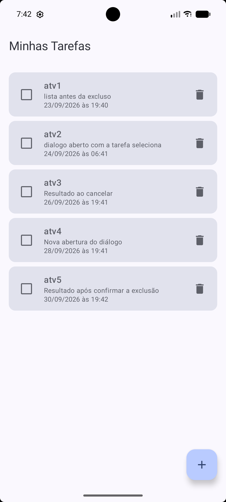
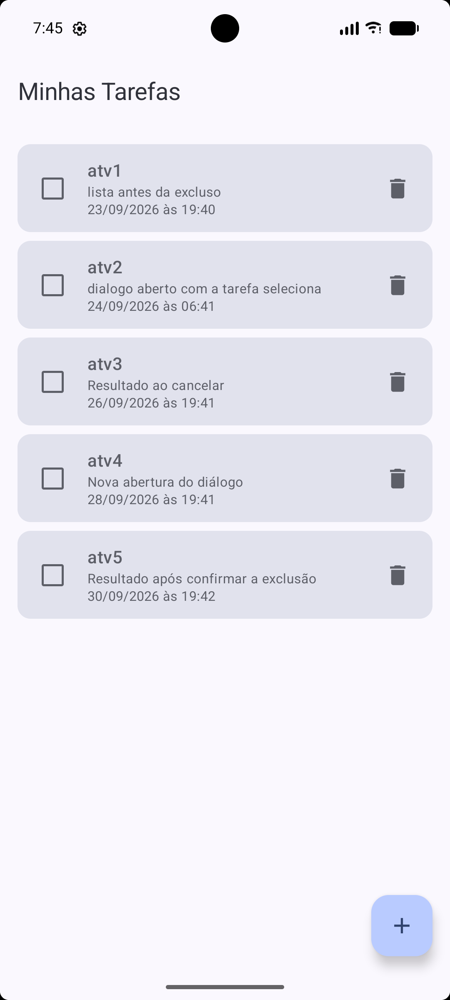
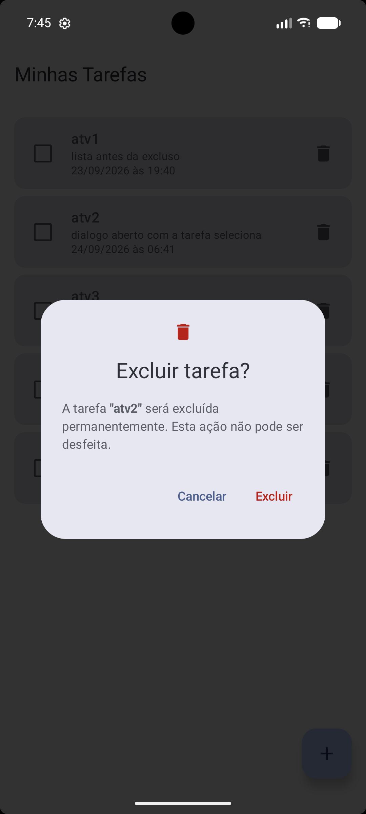
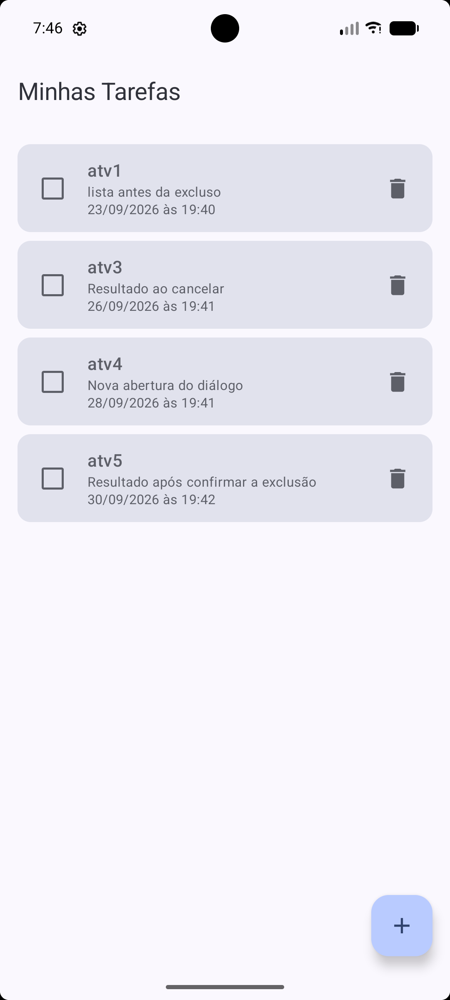

# Evidências — Confirmação de exclusão de tarefas

Este documento registra, em sequência, o novo fluxo de exclusão com confirmação.
Ao tocar no ícone de lixeira, a tarefa **não** é mais excluída imediatamente: um
`AlertDialog` (Material 3) é exibido sobre a própria tela da lista, mostrando o título
da tarefa selecionada e as opções **Cancelar** e **Excluir**.

As imagens foram capturadas no emulador (Pixel 7) e estão em [`docs/prints/exclusao/`](docs/prints/exclusao/).

## 1. Lista antes da exclusão

Lista com cinco tarefas cadastradas (atv1 a atv5), ordenadas por prazo, antes de qualquer tentativa de exclusão.

## 2. Diálogo aberto com a tarefa selecionada

Após tocar na lixeira da tarefa **atv1**, o diálogo de confirmação é exibido sobre a lista,
informando que a tarefa será excluída permanentemente e apresentando o seu título.

## 3. Resultado ao cancelar

Ao tocar em **Cancelar**, o diálogo é fechado e a lista permanece inalterada: as cinco tarefas continuam cadastradas.

## 4. Nova abertura do diálogo

O diálogo é aberto novamente, desta vez tocando na lixeira da tarefa **atv2**. O título exibido
corresponde à tarefa selecionada.

## 5. Resultado após confirmar a exclusão

Ao tocar em **Excluir**, somente a tarefa **atv2** é removida e o diálogo é fechado.
As demais tarefas (atv1, atv3, atv4 e atv5) continuam na lista, com seus prazos e a ordenação preservados.

